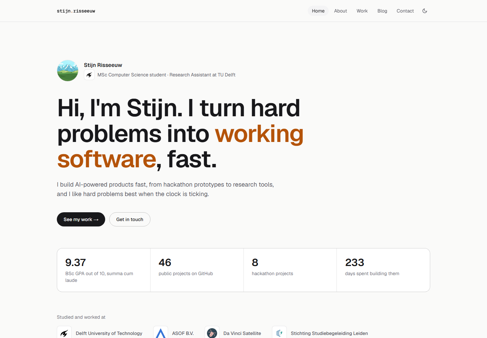

# stijnris.github.io

[](https://github.com/StijnRis/StijnRis.github.io/actions/workflows/deploy.yml)

<a href="https://stijnris.github.io">
  <picture>
    <source media="(prefers-color-scheme: dark)" srcset="docs/screenshot-dark.png">
    
  </picture>
</a>

My personal website at **[stijnris.github.io](https://stijnris.github.io)**: who I am, what I've built and how to reach me.
It's a static [Next.js](https://nextjs.org) site on GitHub Pages that keeps itself up to date from my GitHub profile.

## Features

- **Projects from GitHub.** Every public repo I own or have committed to is shown as a card, with its
  description, topics, README image, languages, team size (bots like Dependabot and Copilot are left out)
  and the periods I was actively developing it.
- **Relevance ranking.** Projects are sorted by a relevance score based on my effort, days of development,
  polish (description, demo, image, topics), recency, stars and ownership. Hackathon projects get
  +10, tutorials −20.
- **Links from GitHub.** Contact links come from the social accounts on my GitHub profile.
- **Light and dark mode.** Auto (follows the system setting), Light or Dark, remembered per visitor.
- **Markdown blog.** Posts are plain `.md` files in [`content/blog`](content/blog).
- **Always fresh.** A GitHub Action rebuilds and deploys on every push and once a day, and commits fresh screenshots for this README.

## Updating content

| To change…                         | Edit                                                                    |
| ---------------------------------- | ----------------------------------------------------------------------- |
| How a project looks                | The repo on GitHub: description, topics, website and README image       |
| Contact links                      | Social accounts on my [GitHub profile](https://github.com/StijnRis)     |
| Blog posts                         | [`content/blog/*.md`](content/blog/README.md)                           |
| Bio, experience and education      | [`lib/site.ts`](lib/site.ts) and [`app/about/page.tsx`](app/about/page.tsx) |
| Organisation logos                 | [`public/logos`](public/logos), linked from `organisations` in [`lib/site.ts`](lib/site.ts) |
| Photo or CV                        | Add `public/photo.jpg` or `public/cv.pdf`                               |

## Development

Requires Node.js and [pnpm](https://pnpm.io).

```bash
pnpm install
GITHUB_TOKEN=$(gh auth token) pnpm fetch-data   # writes data/github.json, needed once before dev
pnpm dev                                        # http://localhost:3000
pnpm build                                      # fetches fresh data and exports the site to out/
```

## How it works

1. [`scripts/fetch-github-data.mjs`](scripts/fetch-github-data.mjs) collects repos through the GitHub API
   (owned repos, plus other public repos found through commit search), computes stats and relevance,
   and writes `data/github.json`. This file is generated, so it's not committed.
2. `next build` renders every page to static HTML in `out/`.
3. [`.github/workflows/deploy.yml`](.github/workflows/deploy.yml) runs both steps, deploys `out/` to GitHub Pages,
   and commits light and dark screenshots of the homepage to [`docs/`](docs).
